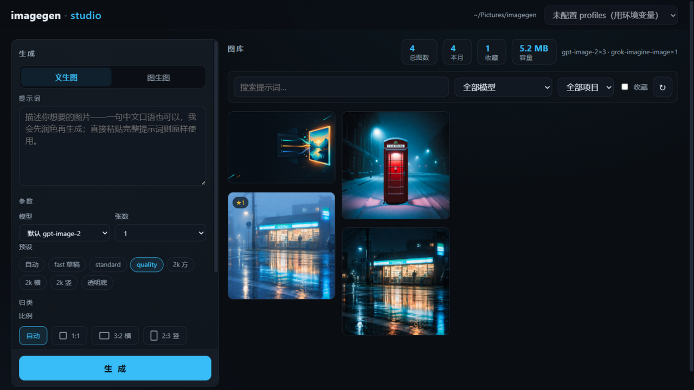

# imagegen studio

[](https://github.com/xinghe-labs/imagegen-studio/actions/workflows/ci.yml)

本地优先的**生图工作台**：生成器为主的中文 Web 界面，跑在 [image-gen](https://github.com/xinghe-labs/image-gen) 引擎上。输入一句提示词（中文口语也行），润色、生成、收藏、变体，一站完成；agent 通道与命令行共用同一份账本，互不干扰。

## 截图



## 功能

- **文生图** — 提示词 + 模型（编号目录）+ 预设/自定义尺寸 + 1-4 张批量，任务进度实时显示，生成中可取消
- **图生图** — 上传 1-4 张参考图（或从图库一键「用作参考」），描述修改方向
- **图库** — sidecar 账本驱动的历史网格：按模型/项目/时间/关键词筛选、只看收藏、★收藏写回记录
- **看图与整理** — 点图放大（←/→ 翻页）、下载、删除（移入回收站、可撤销、7 天自动清理）、多选批量（全选 / Shift 区间）打包下载与删除
- **不丢草稿** — 提示词与参数自动记住，刷新页面后原样恢复
- **多网关配置** — 多套 `{名称, Base URL, API Key}` 一键切换；key 只存服务端配置文件，页面永不回传；部署到带令牌的服务器时可在同一面板里保存/清除访问令牌
- **认证** — 设 `IMAGE_GEN_TOKEN` 启用单令牌，或用 users 文件实现多用户隔离（一人一库）
- **限流** — 认证失败连续 10 次锁定 5 分钟，防 token 爆破
- **抗抖动** — 网关偶发空响应（无 JSON 响应体）自动重试：CLI 用满重试预算，服务端还会把整个任务再跑一次

## 快速开始

前置：安装 [image-gen](https://github.com/xinghe-labs/image-gen) skill（`npx skills add xinghe-labs/image-gen`），并配置好网关（`IMAGE_GENERATION_API_KEY` / `IMAGE_GENERATION_BASE_URL`，或在平台里添加 profile）。

```bash
pip install -r requirements.txt
python scripts/imagegen_server.py          # → http://127.0.0.1:8642
```

服务端按以下顺序寻找引擎：`IMAGE_GEN_CLI` 环境变量 → 仓库同级目录 `image-gen/` → 已安装的 skill 目录（`~/.agents/skills` 等）。

### 配置文件

多网关 profile 存于 `~/.codex/imagegen-profiles.json`：

```json
{
  "profiles": [
    {"name": "apiclaw", "base_url": "https://your-provider.example/v1", "api_key": "sk-..."}
  ],
  "active": "apiclaw"
}
```

key 永不出现在任何 API 响应中；更新 profile 时 key 留空即保留原值。

### 部署到服务器

设 `IMAGE_GEN_TOKEN=<随机串>`（或 `--token`）启用认证——客户端需带 `X-Auth-Token` 头或 `?token=` 参数；图库目录用 `IMAGE_GEN_LIBRARY` 指定；建议置于反向代理（HTTPS）之后。完整步骤（systemd / Docker / Caddy-Nginx 反代 / 安全清单）见 [DEPLOY.md](DEPLOY.md)。本地 Windows 双击 `start.bat` 即可启动。

### 多用户（一人一库，单实例隔离）

给多人用时配置 users 文件（默认 `~/.codex/imagegen-users.json`，或 `IMAGE_GEN_USERS` / `--users` 指定）。用脚本管理最省事：

```bash
python scripts/add_user.py add alice --base-url https://img.example.com   # 生成 token 并打印访问链接
python scripts/add_user.py add admin1 --admin                             # 管理员：可在页面管理用户
python scripts/add_user.py invite --max-uses 10 --hours 168               # 生成邀请码（自助激活）
python scripts/add_user.py list                                           # 查看（token 打码）
python scripts/add_user.py remove alice                                   # 移除（图库文件不动）
```

也可以手写 users 文件：

```json
{
  "users": [
    {"name": "alice", "token": "随机串A", "library": "/data/library/alice"},
    {"name": "bob",   "token": "随机串B"}
  ]
}
```

- 每个用户用**自己的 token** 访问同一地址：`https://img.example.com/?token=随机串A`（页面把 token 存进 localStorage，之后所有请求自动带上，并清掉地址栏里的 token）；
- **管理员**：users 文件里带 `"admin": true` 的用户（或 `add_user.py add ... --admin`），登录后「网关配置」面板出现**用户与令牌管理**区——添加用户、复制邀请链接、换发令牌（旧的立即失效）、移除用户（不动图库文件），改动即时生效无需重启；
- **邀请码分发**：管理员生成短期限次的邀请码（默认 10 次 · 7 天），把码或 `/?invite=码` 链接发到群里，对方打开自己填用户名激活，一人一库自动建好；过期/用完自动失效，可随时撤销；
- 各自的图库互相不可见：历史、统计、生成产物、参考图都落在自己的库目录里；跨库读图/删除/改评分会被拒（403）；
- 未写 `library` 的用户落在 `<IMAGE_GEN_LIBRARY>/<name>`（默认 `~/Pictures/imagegen/<name>`）；
- 配置了 users 文件后，**users 模式优先于单 token**（`IMAGE_GEN_TOKEN` 忽略）；错误或缺失 token 一律 401；
- 连续 10 次认证失败会锁定该来源 5 分钟（防 token 爆破）；
- 网关凭据（profiles）与模型目录是本实例**全局共享**的——由实例所有者为所有用户统一配置；图的存储与可见性按用户隔离。

### 备份

图库（图片 + sidecar 账本 + references）是不可再生的资产，建议定期快照：

```bash
python scripts/backup_library.py --dest D:/backups            # 快照到 D:/backups/imagegen-backup-<时间戳>
python scripts/backup_library.py --dest D:/backups --days 30  # 保留最近 30 份，旧快照自动清理
```

注册每日自动备份（Windows 计划任务；其他平台会打印对应的 cron 行）：

```bash
python scripts/install_backup_task.py --dest D:\backups --days 14 --time 03:30
python scripts/install_backup_task.py --remove       # 移除任务
```

### 登录自启（Windows）

```bash
python scripts/install_autostart.py            # 启动文件夹写入快捷方式（免管理员权限）
python scripts/install_autostart.py --remove   # 卸载
```

在「启动」文件夹生成指向 `pythonw.exe` 的快捷方式，登录后自动后台起服务（无窗口）。服务器上改用 systemd（见 DEPLOY.md）。

## 开发

```bash
python -m unittest discover -s tests -p "test_*.py"
```

测试完全离线（本地 fake 网关 + fake CLI），CI 在 ubuntu 3.10/3.13 + windows 3.11 上跑，并检出 image-gen 仓库作为集成依赖。

前端冒烟测试（`tests/test_ui_smoke.py`）用 Playwright 驱动真实浏览器，覆盖页面加载、草稿记忆、生成全链路、收藏与批量打包：未安装时自动跳过，想跑全的话：

```bash
pip install playwright
python -m playwright install chromium
```

## License

[MIT](LICENSE)
